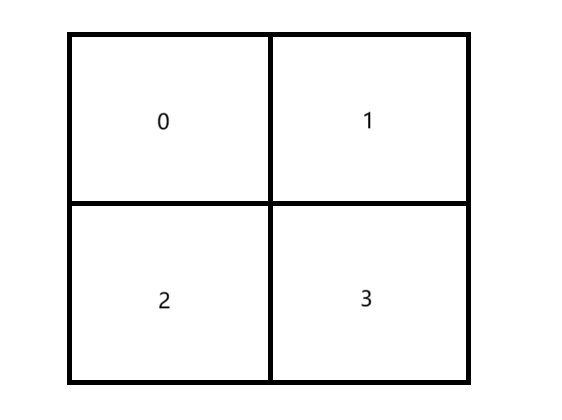

# Quick Start

## Server Rendering Engine

### 1. Download the `Gaia-Server` Installation Package

- Visit the release page and download the `gaia-release.tar.gz` archive.<br>
  [Download link](https://github.com/raina-rise/gaia-release/releases)
- Extract the file to obtain the static library file libgaia-server.a and the include folder.<br>

The directory structure after extraction is as follows:

```
/path/to/project
├── include/
│ ├── Gaia.h
│ └── ...
└── lib/
   └── libgaia-server.a
```

### 2. Install Dependencies

`Gaia-server` depends on the following third-party librarites. Please ensure that these dependencies are installed on the system :

- **Cairo**：Used for 2D graphics rendering, version: `1.15.12`
- **librsvg**：Used for SVG image processing, version: `2.40.20`<br>

### 3. Integrate Gaia-server Into the Project

Integrate the static library and header files of `Gaia-server` into the project and link the relevant libraries during compilation. <br>

**Example: Using CMake Integration**

```cmake
# Set the header file path for Gaia-server
include_directories(/path/to/project/include)

# Set the static library path for Gaia-server
link_directories(/path/to/project/lib)

# Link the Gaia-server static library and dependency libraries
target_link_libraries(target_name gaia-server cairo librsvg-2.0)
```

### 4. Usage Example

```cpp
// The following header files are from Gaia-server
#include "include/Gaia.h"
#include "include/Util.d"

int main(){
  // Input parameters
  int level; // Rendering level：1、2 or 3
  int gaiaId;
  std::vector<int> indexList; // The default tiles for the current level
  bool isSingleCore = false; // Enable multi-core rendering by default

  Gaia &gaia=Gaia::getInstance(gaiaId);

  // Add rect object
  gaia.addRect('rect1', 10, 15, 80, 80);

  // Add path object
  gaia.addPath('path1', 0, 0, 15, 10);
  // Add text object
  gaia.addText('text1', 'Text information', 12, 25);
  // Add image object
  gaia.addImage('image1', 5, 10, 'iVBORw0KGgoAAAANSUhEUgA...');
  // Add svg object
  gaia.addSvg('svg1', 30, 25, 100, 100, 'AND2');
  // If you add a SVG object，you need to import the file path of the SVG.
  GSvg::svgPath = "/path/to/symbol.svg"

  // Call the rendering method to return the base64 string of the tile map, which needs to be concatenated and displayed by the client rendering engine.
  RenderResult result;
  if (isSingleCore) {
    // Single-core
    result = gaia.renderWithSingleCore(level, indexList);
  } else {
    // Multi-core
    result = gaia.renderWithMultiCore(level, indexList);
  }

  // The render method can directly display the result, making it easier for users to view.
  std::string fileName = "imageTest";
  gaia.render(fileName);

}
```

## Client Rendering Engine

### 1. Download Gaia-client Installation Package

To install the client-side rendering engine, use npm. Make sure you have Node.js installed.
```
npm install gaia-client
```

Alternatively, you can download the gaia-client.tar.gz package from the release page, extract it, and copy the dist folder into your project.


### Create Component

```js
<Gaia
  tileData={data}
  tileConfig={{
    tilesNumPerResolution: {x:2, y:2},
  }}
  canvasSize={{ width: 1000, height: 1000 }}
/>
```
To render the tile map, simply import the Gaia component and pass in the basic configuration data. This includes the tileData and tileConfig settings. The tileConfig option's tilesNumPerResolution property defines the number of tiles to render per resolution level (here set to 2x2). The canvasSize property determines the canvas size (set to 1000x1000 here; the default is 200x200 if not provided).

The required format for tileData is as follows:
```
[
  {
      "blockBase64Str": "iVBORw0KGgoAAAANSUhEUgAAAIMAAABICAIAAABa0NFGAAAABmJLR0QA/wD/AP+gvaeTAAAB1klEQVR4nO3cz00CQRiH4W+MBRgacAvwwNEDyQ4nb7YABxugApcObGELMLGEoROOXq1gPbiRPxnIwO7AT/d9wgEXNCOvLDOTja5pGoOAm2sPAC1KqKCECkqooISK21O/wXtbrXKMZOjcqbNY54x5bw6cnVRQQgUlVFBCxclzpz1MpfrSde7EVKovnJ1UUEIFJVRQQgUlVFBCBSVUpK7sQrAQ2vtVtfPQ3pfXEdbVqq7Kmfni2kM5U+p7YjrNOgwkr7F/19KssTPhc0IFJVRQQgUlVFBCBSVUxEqEtYX1pQcyeLE19rR+sef3u2L72Gh0mfEMV6xEeT//+nyY7RxbLDa7Gux25BArEeYTs8nusfF4s++EHLiiQAVzJxWUUEEJFZRQQQkVlFBBCRWUUBFbY7vlmz1+lE/bx4rCiqK9z27Hebw37w8+mvqeqOteBjNox6+P4dqOyzn+WvE5oYISKiihghIqKKGCEioooYISKrr+j4IIt+z/Z4prXlOeVZbm3MFHM5Sw1JH9E8l/eccvjuHspIISKiihghIqKKGCEioooYISKiihghIqupb42UvZvlXm+xjYn1GZ33sFzrx1vLYj9tTl4Pad+vh9OTupoIQKSqighIpvctduWGTJHVUAAAAASUVORK5CYII=",
      "index": 0
  },
  {
      "blockBase64Str": "iVBORw0KGgoAAAANSUhEUgAAAIMAAABICAIAAABa0NFGAAAABmJLR0QA/wD/AP+gvaeTAAABcElEQVR4nO3cQW6DMBQA0f8R9zI5Wc3NuBndVFVXtSEOmZZ5yi4RchgwyEHJfd9DANO7B6AvlqCwBIUlKCxBkRHeO71cKbFtjc/M3sReILP9GWcnCktQWILCEhRzz8VE5/TcMn3z3umFDh3lzk4UlqCwBIUlKOZhW8p12Kb+iv1j4MbGlYjBI6MbfeQ5O1HMtf729rLEslwykNtrnBOPxzXDUDTOifV+l+F38TpBYQkKS1BYgsISFJagaJQoJTK7XjWWSwb8bzXWnfp//IvcIspTY7m36cC+1itNrmdAeMWmsASFJSgsQWEJCktQWILCEhRT/8qS604/1Via+6QcWf3JYf8Wkevtnnfq/r6Z0dzNzk4UlqCwBIUlKCxBYQkKS1BYgsISFJagmIYsOt1w3Wm4cf9R4PNOz3F2orAEhSUoLEFhCQpLUFiCwhIUlqCwBIXrTif1PO906MEn151OqrHVfeT3dXaisASFJSgsQfEJ3h4y6zeyPZkAAAAASUVORK5CYII=",
      "index": 1
  },
  {
      "blockBase64Str": "iVBORw0KGgoAAAANSUhEUgAAAIMAAABICAIAAABa0NFGAAAABmJLR0QA/wD/AP+gvaeTAAABXklEQVR4nO3cQQ6CMBQA0dZ4L3szy8nUk+HCxBXU0lIywXlhYYQQcIKQvyDO8xwqxBg+G34/rG86hfles8+T2Ol8L/270C4sQWEJCktQWIJic4nbLcRYWnJIA46TK4dU/kFql61PsRWb+hTbwn8nCktQWILCEhSWoLAEhSUoLEFhCQpLUNSW+Dlucu500NxpA+dOTfx3orAEhSUoLEFhCQpLUFiCwhIUlqBYKpGfIT+PPpC/t1RieuUpNs9PnDvtN3f6XBA5NR6ac6cm14Xvmhuog3dsCktQWILCEhSWoLAEhSUoLEHh3InCuVMv504Yzp1Oxjs2hSUoLEFhCQpLUFiCwhIUlqBw7kTh3KlX/dwppdJ+nDt1qz7fWHxHlnMnCu/YFJagsASFJSgsQWEJiqWnWA2T8+oqr4njPB6ltV4Tx0mpNPAYUyJOQ3Z7agPe76Qm3icoLEFhCQpLULwBqUFae59ZdwgAAAAASUVORK5CYII=",
      "index": 2
  },
  {
      "blockBase64Str": "iVBORw0KGgoAAAANSUhEUgAAAIMAAABICAIAAABa0NFGAAAABmJLR0QA/wD/AP+gvaeTAAABV0lEQVR4nO3cwXGDMBBA0V2GQtKJ1UlKQZTiSix34k6Uc/ApoBk+8X/jEweN4I/B3gPZe48hco2+jFnqEkaf7zRwLR1hCQpLUFiCwhIUU2YM+dQoZ5/Ltc2jfsRGtojboLU+kXcnCktQWILCEhSWoLAEhSUoLEFhCQpLnKG2qG1zzLnTTjXK/mu1ZqzPzYLOnXaq0Wrfe761v1+r+eiOtEMt78d8TlBYgsISFJagsASFJSgsQWEJCktQOHeicO5E4d2JwhIUlqCwBIUlKCxBYQkKS1BYgsISFHMp0dqgxXIdtNAnyohh74vQEd6dKCxBYQkKS1BYgsISFJagsARFRvTluq/va6/6vNfbd5Svs7fyB2W9l3htXiM4PR5n7Ue/pLMOCJ8TFJagsASFJSgsQWEJCktQWIIil+XK/+z+07TjrN1ow2kHhd8JCktQWILCEhSWoLAExQ9ApkFzinEERwAAAABJRU5ErkJggg==",
      "index": 3
  }
]
```
Where blockBase64Str is the base64-encoded tile, and index represents the index of the tile. For instance, in a 2x2 tile map, the indices are 0, 1, 2, and 3.




Once the basic setup is complete, you will be able to render a 2x2 tile map. This is just the simplest use case; Gaia provides more features, such as resolution switching, incremental updates, and custom event callbacks, to cater to more complex scenarios.

### Tile Map Resolution Switching
Here’s an example of a more advanced use case. Initially, we render a 2x2 tile map, but as we zoom in to a certain level, we want to render a larger map, such as 8x8 or even 32x32, for better detail. 


```js
// handlewheel事件回调函数
const handlewheel = (event: TileMapEventInfo) => {
  if (event.curResolution === 0) {
    fetchTileData("data_2x2");
  } else if (event.curResolution === 1) {
    fetchTileData("data_8x8");
  } else {
    fetchTileData("data_32x32");
  }
};

<Gaia
  tileData={data}
  handlewheel={handlewheel}
  tileConfig={{
    tileSwitchLevel: 4,
    tilesNumPerResolution: [
      { x: 2, y: 2 },
      { x: 8, y: 8 },
      { x: 32, y: 32 },
    ],
  }}
  canvasSize={{ width: 1000, height: 1000 }}
/>
```

In this example, we create a handlewheel callback function. When the user zooms in or out of the tile map, we check the current resolution level from the TileMapEventInfo object’s curResolution property. If the resolution level is 0, we fetch 2x2 tiles; if level 1, we fetch 8x8 tiles; and if level 2, we fetch 32x32 tiles. We update the data variable with the new tile data and pass it to Gaia.

The tileSwitchLevel property determines the resolution switch trigger level, here set to level 4. The tilesNumPerResolution property defines the number of tiles to be rendered at each resolution, which are set to 2x2, 8x8, and 32x32 in this case. When zoomed in to level 4, the tile map will display an 8x8 grid; when zoomed out to level 0, it will display a 2x2 grid.


### Incremental Update
Gaia client’s tile update mechanism uses incremental updates, meaning we only pass in the tiles that are in the visible region, rather than fetching the entire set of tiles again. This helps improve performance.
```js
const handlewheel = (event: TileMapEventInfo) => {
  fetchData(
    event.visibleIndexList,
    event.curResolution
  );
};
```
The TileMapEventInfo object provides the visibleIndexList property, which lists the tiles visible in the current view. The curResolution property indicates the current resolution level. Using these two properties, we can request only the tiles visible on the screen, thus improving performance. For instance, if the visible tile indices are [0, 1] and the resolution level is 0 (2x2 tiles), we only need to update the data for the 0th and 1st tiles, without having to reload the entire tile map. If there are any duplicate updates, the user should handle them to prevent unnecessary data requests.