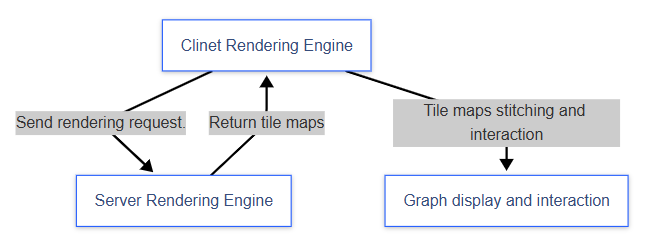

# What is Raina Gaia?

`Raina Gaia` is a high-performance, large-scale graphics rendering and processing tool, composed of **the server rendering engine** `Gaia-server` and **the client rendering engine** `Gaia-client`. Together, they provide users with a smooth graphics rendering and interactive experience.

`Gaia-server` is the server rendering engine of `Raina Gaia`, designed to address the performance bottlenecks of large-scale graphics rendering on the client, offering efficient and flexible rendering capabilities.

`Gaia-client` is the client rendering engine of `Raina Gaia`, aimed at processing the rendering results returned by the server, providing functionalities such as tile stitching and graphic interaction.

Just want to try it out？Skip to the [Quickstart](./quick-start)。

**Workflow Diagram**

:::tip Process Description
**1. Client Request**
The client sends a rendering request to the server. 
**2. Server Rendering Engine**
The server generates tile maps based on the client's request and returns the rendering results. 
**3. Client Rendering Engine**
The client synthesizes the tile maps into the final graphic display and supports graphic interaction functions.

:::

## Use Cases

- **Server Rendering Engine** [Use Cases](./server-use-cases.md):
  - Complex Data Visualization
  - Large-Scale Map Rendering
  - 2D Game Scene
- **Client Rendering Engine** [Use Cases](./client-use-cases.md):

  - Interactive and Display of Online Maps
  - Graphical I Interaction in Data Visualization Tools
  - Graphic Editing Tools
  - 2D Game Graphics Display and User Interaction

  ## Performance

  Unlike traditional rendering engines, Raina Gaia utilizes a server multi-core rendering model, effectively resolving the performance bottlenecks in large-scale complex graphics rendering. The following are the core advantages of Raina Gaia in terms of performance:

  - **Multi-core Rendering Mode** 
    `Raina Gaia` fully leverages the computing power of multi-core CPUs, using a tile-based design approach to distribute rendering tasks across multiple cores for parallel processing, significantly improving rendering speed. Whether it's rendering millions or billions of graphical data points, it can efficiently complete the task.
  - **Incremental Update** 
    `Raina Gaia` supports incremental updates, rendering only the parts that have changed, avoiding unnecessary calculations and resource consumption.
  - **Multi-level Rendering** 
    `Raina Gaia` supports multi-level rendering, dynamically adjusting the rendering details based on user actions. The client caching mechanism ensures a smooth interactive experience.
