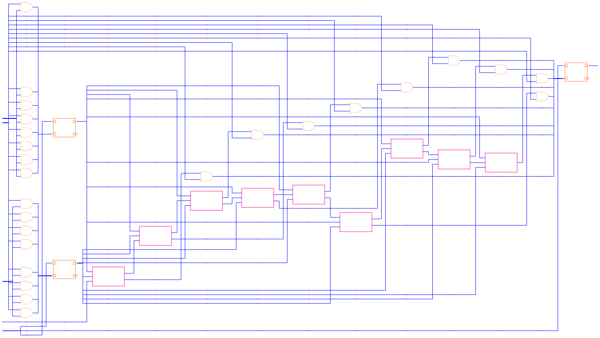

# 概述

`raina-gaia`是一款高性能大规模图形渲染工具，由服务端渲染引擎和客户端渲染引擎组成，提供高效、灵活的渲染能力。

`raina-gaia`支持 `矩形(rect)`、`路径(path)`、`文本(text)`、`图片(image)`或`svg` 五种基础图元对象的渲染，支持单核渲染和多核渲染模式。

`raina-gaia`需要用户提供渲染图元的数据信息，根据用户定义的`矩形(rect)`、`路径(path)`、`文本(text)`、`图片(image)`或`svg`属性信息，输出对应的渲染图，示例渲染图如下：

