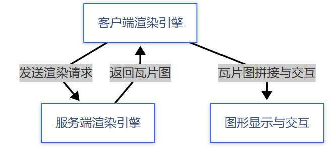
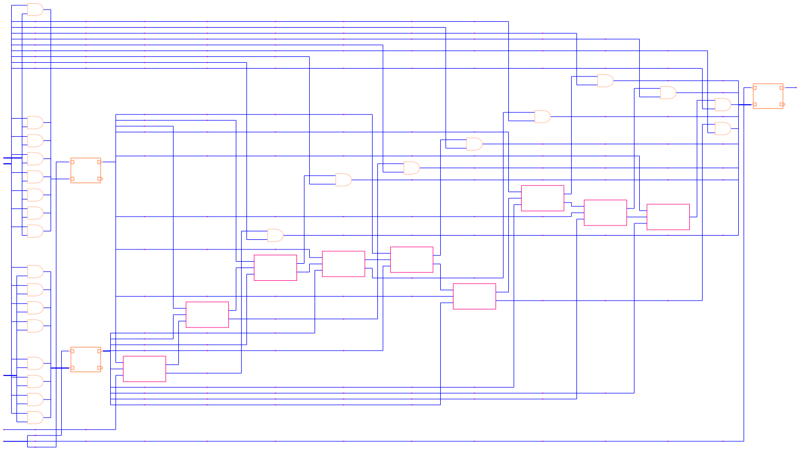

# 什么是 Raina Gaia?

`Raina Gaia`是一款高性能大规模图形渲染与图形处理工具，由**服务端渲染引擎**`Gaia-server`和**客户端渲染引擎**`Gaia-client`组成，两者结合为用户提供流畅的图形渲染与交互体验。

- `Gaia-server`是`Raina Gaia`的服务端渲染引擎，旨在解决客户端大规模图形渲染的性能瓶颈问题，提供高效、灵活的渲染能力。
- `Gaia-client`是`Raina Gaia`的客户端渲染引擎，旨在处理服务端返回的渲染结果，提供瓦片图拼接、图形交互等功能。

**工作原理图**

**流程说明**

1. **客户端请求**
   客户端向服务端发送渲染请求
2. **服务端渲染引擎**
   服务端根据客户端请求生成瓦片图，并返回渲染结果
3. **客户端渲染引擎**
   客户端将瓦片图合成为最终图形显示，并支持图形交互功能

## 服务端渲染引擎

`Gaia-server`支持 `矩形(rect)`、`路径(path)`、`文本(text)`、`图片(image)`或`svg` 五种基础图元对象的渲染，支持多层级的渲染，支持单核渲染和多核渲染模式等功能。

`Gaia-server`需要用户提供渲染图元的数据信息，根据用户定义的`矩形(rect)`、`路径(path)`、`文本(text)`、`图片(image)`或`svg`属性信息，输出对应的渲染图，渲染效果示例下：

> 该图为服务端渲染瓦片图拼接后的结果。

## 客户端渲染引擎

`Gaia-client`能够将服务端返回的瓦片图无缝拼接成完整的渲染图形，提供丰富的图形交互功能，根据用户的缩放操作动态地切换层级，提供高分辨率的渲染结果。
